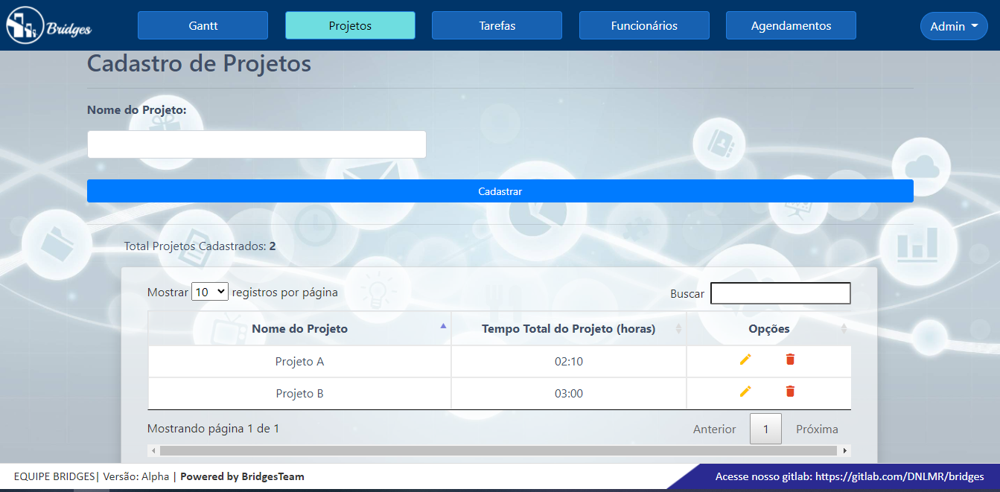
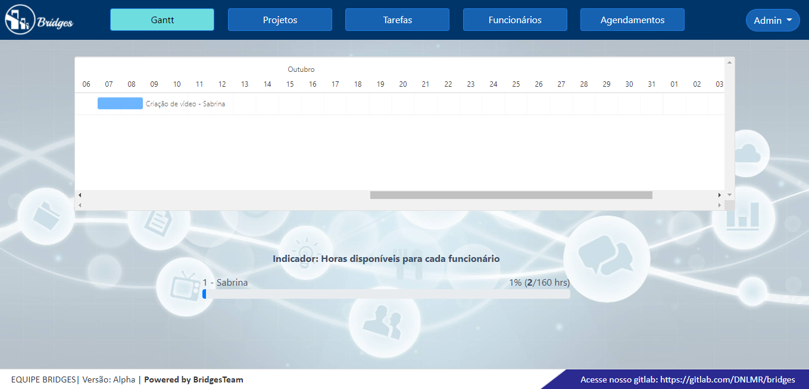

# bridges

### Resumo do Projeto
O projeto foi proposto pela empresa Necto qual a proposta foi criar uma interface que permita o usuário cadastrar todos os aspectos de seu ambiente de desenvolvimento como pessoas(nome e carga horária), projetos(nome e total de horas) e tarefas(descrição e duração). A interface contém também um gráfico gantt para visualização de tarefas.

### Tecnologias adotadas na solução

A linguagem principal escolhida foi python, foi usado o framework Django para construção da interface web integrando HTML, CSS e JavaScript, o gráfico gantt foi gerado usando a biblioteca Frappe Gantt, como banco de dados foi escolhido mysql que foi conectado ao python usando a biblioteca pymysql. Outras práticas foram aplicadas como boas práticas de python e conceitos de Scrum.

* Python 3.7 - Linguagem principal
* PyCharm e/ou Visual Studio Code - IDE
* FrameWork Django 3 - interface WEB
* MySQL - Banco de Dados
* Frappe Gantt - interface do gráfico gantt
* Conceitos do SCRUM - Norteador do Projeto
* Zen of Python - boas práticas para o Projeto
* Principais Bibliotecas Python:  
    **PyMySQL** - interação com nosso Banco de Dados;
    **Crispy Forms** - renderizar formulários com Bootstrap;
    **Import-export** - para importar e exportar arquivos de excel .csv;

### Contribuições individuais/pessoais

Como contribuição pessoal, fui responsável pela criação do front end do projeto, incluindo a implementação do gráfico Gantt. Os códigos foram fragmentados usando um renderizador de formulários chamado crispy forms, com ele conseguimos criar somente um cabeçalho e um rodapé e carrega-los nos templates HTML. Todas as telas são preenchidas com dados direto do banco de dados. O projeto possui ao todo 18 templates HTML entre o header e o footer que foram criados separdamente e carregados com o crispy forms conforme exemplos, as telas principais: Gantt, Projetos, Tarefas, Funcionários e Agendamentos. Compartilharei a seguir algumas das telas principais e trechos dos códigos utilizados. 

#### Tela de Login


A tela acima foi gerada através do código: 
```HTML



<!DOCTYPE html>
<html lang="pt-br">
<title>Bridges - Login</title>
<head>
    <meta charset="UTF-8"/>
    <meta http-equiv="X-UA-Compatible" content="ie=edge"/>
    <link href="" rel="stylesheet" type="text/css"/>
    <link href="" rel="stylesheet" type="text/css" media="screen"/>
</head>
<body class="loginpage">
<div class="card text-center" id="containerlogin">
    <div>
        
    </div>
    <div class="card-body">
        <form method="POST">
            
            <fieldset class="form-group">
                {{ form|crispy }}
            </fieldset>
            <div class="form-group">
                <button class="btn btn-login btn-blue" type="submit">Login</button>
            </div>
        </form>
    </div>
</div>

</body>
</html>
```

#### Tela de projetos


A tela acima foi gerada através do código: 
```HTML





<title>Bridges - Projetos</title>





   <div class="container mt-5 pt-4">

      <br />
      <h2>Cadastro de Projetos</h2>
      <hr />

      <form method="POST">
      
       <div class="form-row">
          <div class="col-md-5 mb-4">
            <label for="validationTooltip01"><strong>{{ create_form.nom_pro.label_tag }}</strong></label>
            {{ create_form.nom_pro }}
            <div class="valid-tooltip">
            </div>
          </div>
       </div>
      <button style="float:right; " class="btn btn-primary btn-sm mt-1 btn-block" type="submit">Cadastrar</button>
        <br/>
         <br/>
    <div>
      </form>
       <hr />
        <P style="float:left; margin-left: 50px;Total"> Total Projetos Cadastrados: <b>{{total_projetos}}</b></P>
  </div>

          <div class="card shadow mb-4 col-md-11 mt-5 bg-transparent60" style="margin-left: 45px;">
        <div class="card-body">
          <div class="table-responsive">
            <table class="table table-bordered text-center"  width="100%" cellspacing="0">
              <thead>
                <tr>
                  <th width="50" scope="col">Nome do Projeto</th>
                  <th width="30" scope="col">Tempo Total do Projeto (horas)</th>
                <th width="60" scope="col">Opções</th>
                </tr>
              </thead>
              <tbody>
                
                <tr>

                  <td>{{projeto.nom_pro}}</td>
                  <td>
                      
                        {{projeto.total_hours|stringformat:"02d"}}:{{projeto.total_minutes|stringformat:"02d"}}
                    
                        00:00
                    
                  </td>
                  <td>
                    <a class="add" title="Add" data-toggle="tooltip"><i class="material-icons">&#xE03B;</i></a>
                    <a href="" class="edit" title="Edit" data-toggle="tooltip"><i class="material-icons mr-4">&#xE254;</i></a>
                    <a href="" class="delete" title="Delete" data-toggle="tooltip"><i class="material-icons">&#xE872;</i></a>
                  </td>
                </tr>
                
              </tbody>
            </table>
          </div>
        </div>
      </div>
  </div>


```

#### Tela do gráfico Gantt


A tela acima foi gerada através do código: 
```HTML





<title>Bridges - Gantt</title>






        <div class="container mt-5 pt-5">
          <div class="card" style="overflow: scroll">
            <svg id="gantt"></svg>
          </div>
        </div>     
...

...
 <!-- Gráfico de indicadores - Funcionários -->
    <div class="card-body">
      <div class="row">
        <!-- /.col -->
        <div class="container mt-5">
          <div class="col-md-7" style="margin-left: 200px;">
                <p class="text-center">
                    <strong>Indicador: Horas disponíveis para cada funcionário</strong>
                </p>
                
                <!-- /.progress-group -->
                <div class="progress-group mt-3">
                    {{indicadores.id_fun}} - {{indicadores.nom_fun}}
                    <span class="float-right">0{{indicadores.ocupacao}}%  (<b>0{{indicadores.duracao_tarefa}}</b>/{{indicadores.limite}} hrs)</span>
                    <div class="progress progress-sm">
                        <div class="progress-bar bg-dangerbg-primary" style="width:{{indicadores.ocupacao}}%"></div>
                    </div>
                </div>
                
            </div>
            <div class="col-md-7 mt-3"><br /><br /></div>
            <!-- /.progress-group -->
          </div>
          <!-- /.col -->
      </div>
      <!-- /.row -->
  </div>     
 
```
#### O gráfico Gantt
Para a construção do gráfico foi usada o framework baseado em JavaScript [Frappe.io/gantt](https://github.com/frappe/gantt). O gráfico mostra o nome da tarefa, funcionário responsável, início e fim de uma tarefa, e porcentagem da tarefa. Dentro do gráfico é possível alterar a data de início e fim de uma tarefa em quantidade de dias, realocar a tarefa para outro dia e modificar a porcentagem de conclusão. Os dados são inseridos no gráfico por requisição POST no banco de dados como mostra o código a seguir:
``` HTML
...
<script>
          var tasks = [
            
                {
                id: '{{agenda.fk_tar_id}}',
                custom_class: 'gantt-color',
                name: '{{agenda.fk_tar}} - {{agenda.fk_fun}}',
                start: '{{ agenda.dt_inicio|date:"Y" }}-{{ agenda.dt_inicio|date:"m" }}-{{ agenda.dt_inicio|date:"d" }}',
                end: '{{ agenda.dt_fim|date:"Y" }}-{{ agenda.dt_fim|date:"m" }}-{{ agenda.dt_fim|date:"d" }}',
                progress: '{{agenda.prog_tar}}'
                },
            
        ]
          var gantt = new Gantt('#gantt', tasks, {
            on_click: function (task) {
              console.log(task);
            },
            on_date_change: function(task, start, end) {

                // convertendo data para enviar alerta ao usuário
                var data_convertida  = ""
                var data_convertida2  = ""
                data_convertida = data_convertida.concat(start.getDate(), "/", start.getMonth()+1, "/", start.getFullYear())
                data_convertida2 = data_convertida2.concat(end.getDate(), "/", end.getMonth()+1, "/", end.getFullYear())
                // alert(data_convertida);

                // enviando o post para URL do django
                var xhr = new XMLHttpRequest();
                xhr.open("POST", '', true);
                xhr.setRequestHeader('Content-Type', 'text/plain');
                xhr.send(JSON.stringify(task));
                alert('Data da tarefa "' + task.name + '" alterada com Sucesso!\n' + 'Novo Data de Início: ' + data_convertida + '\nNova Data de Fim: ' + data_convertida2)
            },
            on_progress_change: function(task, progress) {
                var xhr = new XMLHttpRequest();
                xhr.open("POST", '', true);
                xhr.setRequestHeader('Content-Type', 'text/plain');
                xhr.send(JSON.stringify(task));
                alert('Progresso da tarefa ' + task.name + ' alterado para: ' + progress + '%' + ' com sucesso!')
            },
            on_view_change: function(mode) {
              console.log(mode);
            },
            view_mode: 'Day',
            language: 'ptBr',
            });
        </script>
...
```

### Aprendizados Efetivos

* **Python e Django** 
<p>Com a realização deste projeto foi possível aprimorar meus conhecimentos em python. Foi utilizado novamente a biblioteca Django para construir a interface Web mas dessa vez integrando ao crispy forms que auxiliou na renderização dos formulários.</p>


